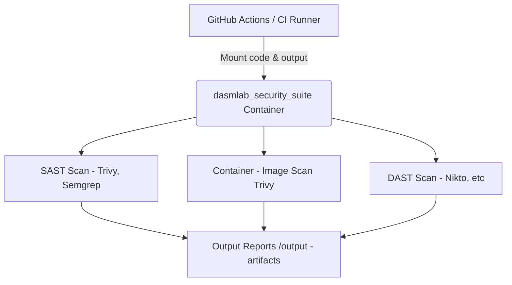

# Security Suite

**A portable, containerized security suite for DevSecOps pipelines.**

---

## Overview

`dasmlab_security_suite` is a modular, all-in-one security toolkit designed for seamless integration into CI/CD workflows. It provides both **SAST** (Static Application Security Testing) and **DAST** (Dynamic Application Security Testing) capabilities inside a single container, allowing you to run code analysis, container image scans, and runtime endpoint tests with zero setup on any platform.

Reports are automatically generated and exported as build artifacts, making security feedback a first-class part of your automation pipeline.

**Check out [PROJECT.md](./PROJECT.md) for more indepth design details**

---

## Architecture



---

## Highlights

- **One container, many tools:** Trivy, Semgrep, Nikto, and more, pre-installed.
- **CI/CD ready:** Plug directly into GitHub Actions, GitLab CI, Jenkins, or local workflows.
- **Both SAST and DAST:** Scan code, containers, and endpoints in a single run.
- **Auto-exported reports:** All scan results are placed in a single output directory for easy artifact storage and review.
- **Minimal config:** Pass in your app's container name and endpoint, mount code/output, and go!

---
### Current Tools Embedded

#### SAST (Static Application Security Testing)
- **Trivy** – Scans source code for known vulnerabilities, secrets, and misconfigurations.
- **Semgrep** – Fast, customizable static analysis for code patterns, bugs, and security issues.

#### DAST (Dynamic Application Security Testing)
- **Nikto** – Lightweight web server scanner for common vulnerabilities, misconfigurations, and insecure files.

---

## Usage

### In your CI pipeline:

```yaml
- name: Run Security Suite
  run: |
    docker run --rm \
      -v ${{ github.workspace }}:/workspace:ro \
      -v ${{ github.workspace }}/security_reports:/output \
      --network $NETWORK_NAME \
      -e GITHUB_WORKSPACE=/workspace \
      -e CONTAINER_NAME=${{ env.CONTAINER_NAME }} \
      -e TARGET_ENDPOINT="http://myapp:8080" \
      dasmlab-security-suite:latest

- uses: actions/upload-artifact@v4
  with:
    name: security-reports
    path: security_reports/
```

#Local quickstart

docker build -t dasmlab-security-suite:latest .
docker run --rm \
  -v $(pwd):/workspace:ro \
  -v $(pwd)/security_reports:/output \
  -e GITHUB_WORKSPACE=/workspace \
  -e CONTAINER_NAME=myapp:latest \
  -e TARGET_ENDPOINT=http://localhost:8080 \
  dasmlab-security-suite:latest

## Local Test Loop

You can run ./test_local.sh to fire up a known container (see the script to set one you like) and to download some source code from a external source as well as the Security Suite container alongside and generate reports.  This generates reports based on whichever tools are enabled / disabled in the Container Suite.

Example Usage


#Reports

All results are written to /output (or the mounted directory of your choice), and can be uploaded as CI artifacts or reviewed directly in CI/CD Pipelines.
